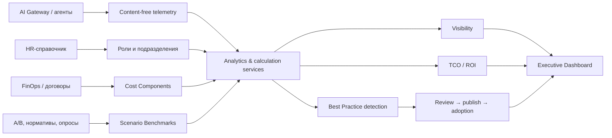

# Arvexo Radar

> **Измеряем то, что работает. Масштабируем то, что работает.**

Radar — Enterprise AI Effectiveness & Knowledge Platform. Он отвечает IT-директору на три вопроса: как сотрудники и подразделения используют AI, окупается ли корпоративная AI-инфраструктура и какие успешные практики нужно масштабировать.

«Radar не только показывает, как компания использует AI. Он измеряет экономический эффект и превращает локальный опыт сотрудников в масштабируемые корпоративные практики».

**Текущая версия:** v0.3.0 — Enterprise Effectiveness MVP
**Статус:** системная телеметрия, TCO/ROI, Knowledge Discovery, adoption workflow и интерактивный Dashboard реализованы
**Целевой домен:** `radar.arvexo.ru`
**Исходный кейс:** КРОК

## Три ценности Radar

- **Visibility** — пользователи, роли, подразделения, запросы, модели, агенты, инструменты, токены, стоимость, ошибки и стабильность.
- **Business Value** — полная стоимость AI, экономия времени, FTE-эквивалент, денежная экономия, Net Benefit, ROI и окупаемость сценариев.
- **Knowledge Sharing** — обнаружение, экспертная проверка, публикация, рекомендация и отслеживание внедрения лучших практик.

Radar показывает подтверждённые логами usage/proxy signals. Он **не утверждает причинно-следственную экономию без бизнес-бенчмарка**, не предназначен для оценки отдельных сотрудников и не раскрывает содержимое промптов в Best Practice.

## Потоки данных



Техническая успешность (`success_rate`, ошибки, latency) не называется качеством бизнес-результата. В production `user_id` хешируется с server-side salt; тексты запросов и ответов в телеметрии не сохраняются.

## Метрики и формулы

Системные метрики: total/successful/failed requests, success/error rate, avg/median/p95 latency, TTFT, prompt/completion/total tokens, average tokens/request, token cost, DAU/WAU/MAU, unique users и разрезы по моделям, агентам, инструментам, ролям и подразделениям.

```text
input_cost  = prompt_tokens / 1_000_000 × input_price_per_1m_tokens
output_cost = completion_tokens / 1_000_000 × output_price_per_1m_tokens
request_cost = input_cost + output_cost

A = Σ выбранных Cost Component
time_saved_minutes = Σ(completed_tasks × minutes_saved_per_task)
fte_saved = time_saved_minutes / monthly_work_minutes_per_fte
B = money_saved = fte_saved × average_monthly_fte_cost
net_benefit = B - A
ROI = (B - A) / A × 100%
payback_ratio = B / A
```

Для периода длиннее месяца Radar нормализует FTE как средний эквивалент мощности за период, а денежную экономию считает за весь период. При `A = 0` ROI/payback возвращаются как unavailable, а не бесконечность.

**FTE Saved — эквивалент высвобождённого рабочего времени, а не количество уволенных сотрудников.** Demo default `average_monthly_fte_cost = 400 000 ₽` хранится в редактируемой методике, а не внутри формулы.

## Полная стоимость AI

`Cost Component` поддерживает token, inference, subscription, hardware depreciation, electricity, infrastructure, support, optional development team и other. Общие расходы распределяются по запросам, токенам, времени инференса, фиксированной доле или конкретному агенту. Стоимость команды разработки включается только настройкой методики. Внутренняя модель может иметь нулевой публичный token tariff и получать стоимость через инфраструктурные компоненты.

## Фактические, оценочные и demo-данные

- **Фактические production-источники:** gateway timestamps/status/errors, model и token usage провайдера, salted `user_id_hash`, переданные metadata, effective-dated model tariff.
- **Требуют внешних production-интеграций:** HR role/team/location, FinOps/GPU/electricity/support, реестр подписок, task completion из бизнес-систем, A/B/нормативные benchmark, владельцы и эффект adoption.
- **Demo/mock:** связный набор июля 2026 в `app/demo_enterprise.py`, включая четыре агента, шесть подразделений, tool usage, TCO, benchmark и adoption. В нём A = 1,17 млн ₽, B = 2,269 млн ₽. UI и API явно возвращают provenance `demo` и долю оценочных данных.

Seed сохраняет конфигурационные и workflow-сущности в PostgreSQL; высокообъёмная серия запросов остаётся агрегированным mock, чтобы не выдавать synthetic события за production telemetry.

## MVP flow

```text
Upload
→ Validation
→ Normalization
→ Sensitive Data Masking
→ Embeddings
→ Classification
→ Scenario Clustering
→ Scenario Naming and Summarization
→ Best Practice Detection
→ Business Insights
→ Executive Dashboard
→ PDF Report
```

## AI Best Practices и Knowledge Discovery

Модуль автоматически превращает сильные повторяемые AI-сценарии в управляемый каталог знаний компании. После именования сценариев worker агрегирует только безопасные метаданные участников кластера и передаёт их классификатору через интерфейс `BestPracticeClassifier`. В MVP используется `RuleBasedBestPracticeClassifier`; позже его можно заменить AI-классификатором без изменения БД, API и Dashboard.

### Impact Score

Impact Score находится в диапазоне `0-100` и является взвешенной суммой пяти нормализованных компонентов:

```text
Impact Score = 20% пользователей
             + 20% частоты использования
             + 20% средней оценки
             + 20% экономии времени
             + 20% успешности сценария
```

Нормализация MVP: 20 пользователей, 50 использований и 40 сэкономленных часов дают максимум соответствующего компонента; оценка переводится из диапазона `1-5`, успешность уже хранится как доля `0-1`. Результат ограничивается диапазоном `0-100` и округляется до одного знака.

Candidate Best Practice создаётся, когда одновременно выполнены правила:

- Impact Score не ниже `70`;
- не менее `8` использований и `3` разных пользователей;
- успешность не ниже `80%`;
- ошибка не выше `20%`;
- средняя пользовательская оценка не ниже `4.0`.

Отсутствующие rating/success signals не считаются положительными: Radar не создаёт практику только по размеру кластера. Confidence Score отражает полноту метаданных, cohesion сценария и объём наблюдений. Экономия FTE для месячного периода считается как `сэкономленные часы / 160`.

Для расчёта используются canonical `user_id`, `team`, `direction`, `agent_id`, `timestamp` и разрешённые ключи JSON-поля `metadata`: `department`, `model`, `rating`, `time_saved_minutes`, `success`, `error`. Остальные ключи не сохраняются в аналитических метаданных.

Статусы workflow: `detected`, `under_review`, `approved`, `rejected`, `published`. Публикация разрешена только после согласования; повторные approve/publish запросы идемпотентны. Каждая практика получает текстовую рекомендацию на основе охвата подразделений и типа сценария.

API модуля:

- `GET /api/best-practices`
- `GET /api/best-practices/top`
- `GET /api/best-practices/{id}`
- `POST /api/best-practices/{id}/approve`
- `POST /api/best-practices/{id}/publish`

Dashboard реализован на основе предоставленного макета Arvexo Radar. В «Обзоре» показаны две ведущие практики, полный каталог доступен в `AI Best Practices`, а `Knowledge Discovery` содержит новые, быстрорастущие и эффективные практики, группировки по подразделениям и моделям. Frontend читает Radar API; если локальный backend недоступен, он явно помечает встроенный набор как демонстрационные данные.

## Зафиксированный стек

- **Frontend:** Next.js 15, TypeScript, Tailwind CSS, shadcn/ui, Recharts, TanStack Query.
- **Backend:** FastAPI, Python, SQLAlchemy 2, Alembic, Pydantic.
- **Database:** PostgreSQL, pgvector.
- **Infrastructure:** Docker, Docker Compose, Makefile.
- **AI/ML:** local-first embeddings/classification/clustering; Gemini Flash через BotHub API для bounded generation; mock provider и подключаемый local test provider.

H100 в v0.1.0 не используется. Средний размер запроса по ТЗ принимается равным `100k токенов`, поэтому pipeline требует chunking без silent truncation.

## Документация

Документация — Single Source of Truth. Код реализуется только после утверждения соответствующей спецификации.

### Product

- [Vision](./docs/01-vision.md)
- [Business Problem](./docs/02-business-problem.md)
- [Stakeholders](./docs/03-stakeholders.md)
- [Personas](./docs/04-personas.md)
- [Product Goals](./docs/05-product-goals.md)
- [Non-goals](./docs/06-non-goals.md)
- [Functional Requirements](./docs/07-functional-requirements.md)
- [Dataset](./docs/08-dataset.md)

### Design and engineering

- [Architecture](./docs/09-architecture.md)
- [AI Pipeline](./docs/10-ai-pipeline.md)
- [Dashboard](./docs/11-dashboard.md)
- [Backend](./docs/12-backend.md)
- [Frontend](./docs/13-frontend.md)
- [Database](./docs/14-database.md)
- [API](./docs/15-api.md)
- [Security](./docs/16-security.md)
- [Deployment](./docs/17-deployment.md)

### Delivery

- [Roadmap](./docs/18-roadmap.md)
- [Demo Script](./docs/19-demo-script.md)
- [Judges FAQ](./docs/20-judges-faq.md)
- [Architecture Decisions](./docs/21-architecture-decisions.md)
- [CI/CD](./docs/22-ci-cd.md)
- [System Analytics](./docs/system-analytics.md)
- [AI Best Practices и Knowledge Discovery](./docs/23-best-practices.md)
- [Enterprise Effectiveness, TCO, ROI и Adoption](./docs/24-enterprise-effectiveness.md)
- [Обоснование метрик для demo pitch](./docs/25-dashboard-metrics-pitch.md)

Краткие entry points: [ARCHITECTURE.md](./ARCHITECTURE.md), [SECURITY.md](./SECURITY.md), [API.md](./API.md), [DEMO.md](./DEMO.md), [ROADMAP.md](./ROADMAP.md).

## Исходные материалы

- [ТЗ кейса КРОК](./кейс%20КРОК%20__%20текст.pdf)

Примеры из ТЗ рассматриваются как темы запросов, а не как подтверждённый production dataset или разрешение на прямые интеграции.

## Локальный запуск

```bash
cp .env.example .env
make up
```

`api` контейнер применяет Alembic-миграции при старте. `worker` опрашивает `analysis_jobs` (`SELECT ... FOR UPDATE SKIP LOCKED`) и выполняет весь пайплайн анализа: embeddings → classification → clustering → scenario naming (LLM) → insights/recommendations (LLM). Полный контракт запуска — в [Deployment Specification](./docs/17-deployment.md).

OpenAI-compatible proxy доступен по `POST /v1/chat/completions`, системная и бизнес-аналитика — по `/api/analytics/*`. Схема телеметрии описана в [System Analytics](./docs/system-analytics.md), а TCO/ROI и Knowledge Adoption — в [Enterprise Effectiveness](./docs/24-enterprise-effectiveness.md).

Демонстрационный сквозной сценарий (`provider_mode=mock`, без внешних ключей):

```bash
curl -F file=@sample.csv http://localhost:8000/api/v1/datasets
curl -X POST http://localhost:8000/api/v1/datasets/{dataset_id}/runs \
  -H "Content-Type: application/json" -d '{"provider_mode":"mock"}'
curl http://localhost:8000/api/v1/runs/{run_id}
curl http://localhost:8000/api/v1/runs/{run_id}/overview
curl -X POST http://localhost:8000/api/v1/runs/{run_id}/reports
curl http://localhost:8000/api/v1/reports/{report_id}/download -o report.pdf
```

### Миграции и demo seed

```powershell
docker compose up -d db
docker compose run --rm api alembic upgrade head
docker compose run --rm api python -m app.seed_demo
```

`alembic downgrade 0004` удаляет только enterprise-сущности migration `0005`. Seed идемпотентен и не сохраняет тексты промптов.

### Проверки

```powershell
.\backend\.venv\Scripts\python.exe -m pytest backend
.\backend\.venv\Scripts\python.exe -m ruff check backend
cd frontend
npm run lint
npm run build
```

### Основные API Enterprise MVP

- `GET /api/analytics/{overview,usage,models,agents,tools,departments,costs,business-effect,roi,insights}`;
- `GET|PUT /api/methodology`;
- `GET|POST /api/cost-components`, `PUT|DELETE /api/cost-components/{id}`;
- полный Best Practice lifecycle: review, approve, reject, publish, recommend и adoption.

Все агрегированные analytics endpoints принимают `date_from`, `date_to`, `department`, `role`, `user`, `agent`, `model`, `scenario`, `tool`.

### Известные упрощения MVP (см. код для деталей)

- **Embeddings** — детерминированный hashing-векторизатор (`app/domain/embeddings.py`), не обученная семантическая модель; реальная локальная модель выбирается после аудита reference dataset (docs/10-ai-pipeline.md).
- **Classification** — keyword-fallback (`app/domain/classification.py`), объяснимый baseline, а не семантический классификатор.
- **Clustering** — жадная косинусная кластеризация (`app/domain/clustering.py`), плейсхолдер до выбора алгоритма по ADR (docs/09-architecture.md).
- **Chunking длинных запросов** (100k-token records) не реализован — каждая запись обрабатывается как один chunk.
- **Причинность:** денежная экономия не считается фактической без утверждённого Scenario Benchmark; экспертные оценки помечаются.
- **Demo analytics adapter:** полный enterprise dashboard питается связным synthetic dataset; production DB adapter для HR/FinOps/business outcome sources остаётся интеграционной задачей.
- **Права workflow:** demo tenant используется без production IAM; production review/adoption требует RBAC и audit log.
- PDF-отчёт использует встроенный DejaVu Sans (для кириллицы); шрифт ставится в образ через `fonts-dejavu-core` (см. `backend/Dockerfile`).

## CI/CD

GitHub Actions: `ci.yml` (lint + pytest против реальной Postgres+pgvector + build-check образов) на каждый push/PR, `cd.yml` (publish в GHCR + SSH-деплой на `main`) — после того как CI на этом же commit прошёл. Подробности, требуемые secrets и диагностика сбоев — в [docs/22-ci-cd.md](./docs/22-ci-cd.md).

## Участие в разработке

Правила изменений, тестирования, безопасности и документации приведены в [CONTRIBUTING.md](./CONTRIBUTING.md). История версии — в [CHANGELOG.md](./CHANGELOG.md).

## Лицензия

Проект не распространяется по open-source лицензии. См. [LICENSE](./LICENSE).
