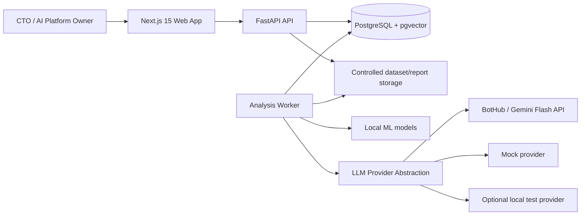
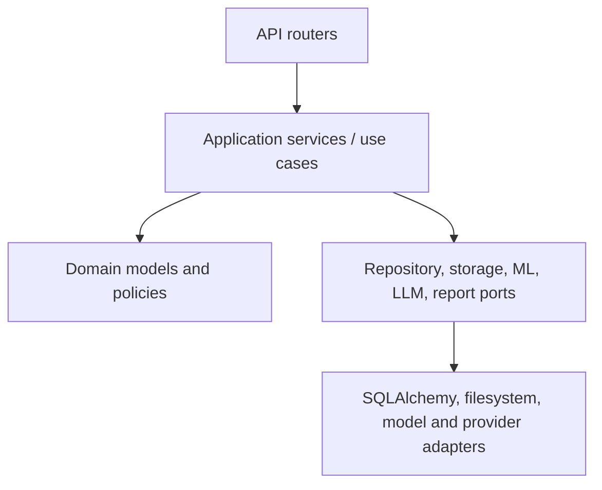
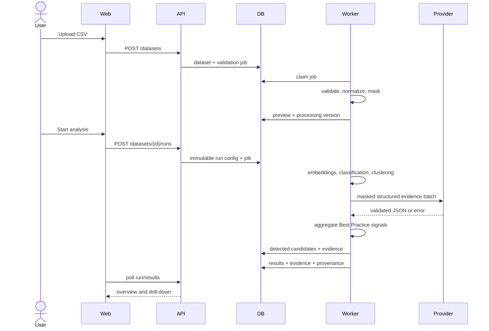

# Arvexo Radar: архитектура системы

**Версия:** v0.1.0 — Hackathon MVP
**Статус:** архитектурная спецификация

## 1. Цели архитектуры

- воспроизводимый batch analysis длинных запросов;
- explainability и provenance каждого результата;
- безопасная граница до внешней LLM;
- graceful degradation без генеративного API;
- локальный запуск Docker Compose;
- отсутствие зависимости domain logic от конкретного LLM provider.

## 2. System context

`Controlled storage` в MVP может быть Docker volume. Объектное хранилище не добавляется до отдельного решения.

## 3. Контейнеры

| Контейнер | Ответственность | Технология |
|---|---|---|
| `web` | UI, navigation, query state | Next.js 15, TypeScript, Tailwind, shadcn/ui, Recharts, TanStack Query |
| `api` | HTTP contracts, validation, orchestration commands | FastAPI, Pydantic, SQLAlchemy 2 |
| `worker` | Batch pipeline и report jobs | Python application из того же backend package |
| `db` | Transactional state, analytics results, vectors | PostgreSQL, pgvector |

Worker — отдельный process type, а не новый внешний сервис. Очередь реализуется таблицей jobs с блокировкой PostgreSQL; Redis/Celery не входят в утверждённый стек.

## 4. Backend layers

- Routers не содержат ML/business logic.
- Domain не импортирует FastAPI, SQLAlchemy или конкретный provider SDK.
- Application service управляет transaction boundary и state transition.
- Adapters переводят ошибки инфраструктуры в типизированные application errors.

## 5. Основной data flow

## 6. Trust boundaries

1. **Browser → API:** недоверенный input, authentication context, rate limits.
2. **Uploaded file → processing:** строгий parser, content limits, quarantine until validation.
3. **Raw → masked data:** после boundary downstream-компоненты используют masked text.
4. **Worker → external LLM:** только минимизированный evidence package.
5. **API → report:** output escaping и единый persisted result set.
6. **Scenario → Best Practice:** только агрегированные allowlisted metadata; classifier не получает raw text.

## 7. Analysis state model

Допустимые состояния run:

`queued → validating → normalizing → masking → embedding → classifying → clustering → generating → insights → completed`

Терминальные варианты: `completed`, `degraded`, `failed`, `cancelled`. Переходы проверяются централизованно; возврат назад и перезапись завершённого run запрещены.

## 8. Масштабирование MVP

- API остаётся stateless относительно process memory.
- Jobs claims используют `SELECT ... FOR UPDATE SKIP LOCKED`.
- Один dataset обрабатывается ограниченным числом параллельных batches.
- Concurrency и memory budget конфигурируются.
- Векторы и результаты пишутся batches.
- 100k-token records chunked до model invocation.

## 9. Reliability

- idempotency keys для create-run/report;
- checksum и config snapshot для воспроизводимости;
- bounded retries только для transient failures;
- provider circuit/open state может быть локальным для worker process в MVP;
- частичные генеративные ошибки дают `degraded`, сохраняя локальную аналитику;
- health/readiness разделены.

## 10. Observability

Структурированные логи содержат request/job/run IDs, stage, duration, counts и error code, но не request text, samples, credentials или provider payload. Метрики могут выводиться в application log/health response MVP; отдельная monitoring platform не добавляется.

## 11. Архитектурные ограничения

- зафиксированный стек не изменяется без ADR;
- H100 не используется;
- конкретная local ML model и clustering algorithm выбираются после проверки reference dataset;
- production SSO и object storage оставлены за границей MVP;
- API provider secret доступен только backend worker.

## 12. Критерии приёмки

- **ARCH-AC-01:** frontend не обращается к DB/LLM напрямую.
- **ARCH-AC-02:** domain logic не импортирует конкретный LLM SDK.
- **ARCH-AC-03:** локальный анализ завершается при недоступном provider.
- **ARCH-AC-04:** downstream masking boundary не получает raw text.
- **ARCH-AC-05:** run воспроизводим по dataset version, config и model provenance.
- **ARCH-AC-06:** вся система запускается Docker Compose.

## 13. Связанные документы

- [AI Pipeline](./10-ai-pipeline.md)
- [Backend](./12-backend.md)
- [Database](./14-database.md)
- [Security](./16-security.md)
- [Architecture Decisions](./21-architecture-decisions.md)
