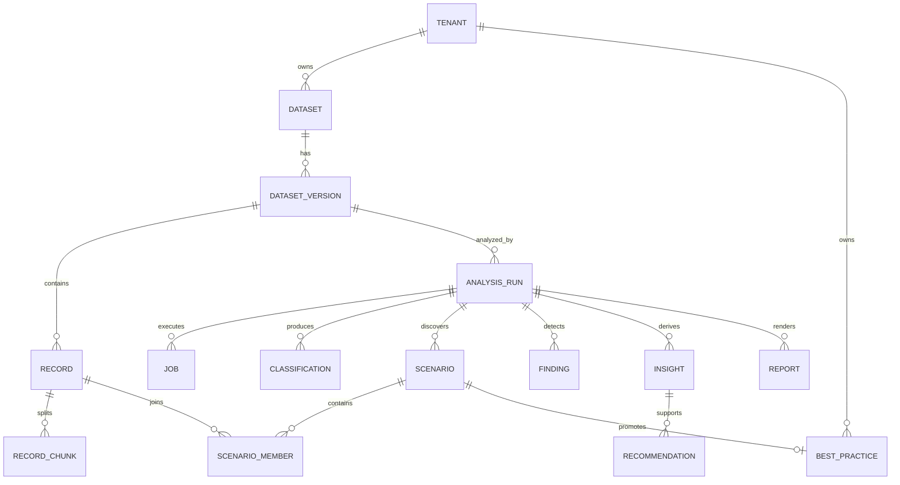

# Arvexo Radar: database

**Версия:** v0.1.0 — Hackathon MVP
**Стек:** PostgreSQL, pgvector, SQLAlchemy 2, Alembic

## 1. Принципы модели

- UUID primary keys, UTC timestamps;
- tenant/owner context на ресурсах;
- immutable processing/run results;
- raw и masked content разделены;
- JSONB только для версионированных расширяемых payloads, не вместо основных relations;
- vectors связаны с model/chunking version.

## 2. Основные сущности

## 3. Таблицы

### `tenants`

`id`, `name`, `created_at`. В demo mode существует один локальный tenant; модель сохраняет production boundary.

### `datasets`

`id`, `tenant_id`, `display_name`, `source_filename_safe`, `checksum`, `status`, `created_by`, `created_at`. Client path не хранится.

### `dataset_versions`

`id`, `dataset_id`, `schema_mapping`, `validation_summary`, `normalization_version`, `masking_version`, `storage_refs`, `created_at`.

### `records`

`id`, `dataset_version_id`, `external_request_id`, `row_number`, protected raw reference, masked text or protected reference, metadata fields, token_count, validation_status, warnings, sanitized_hash. Raw column access ограничен backend boundary.

### `record_chunks`

`id`, `record_id`, `position`, `masked_text`, `token_count`, `embedding vector`, `embedding_model_version`, `chunking_version`. Unique `(record_id, position, chunking_version)`.

### `analysis_runs`

`id`, `tenant_id`, `dataset_version_id`, `status`, `stage`, `config_snapshot`, `model_provenance`, `started_at`, `completed_at`, `error_code`, `created_by`.

### `analysis_jobs`

`id`, `run_id`, `stage`, `status`, `attempts`, `available_at`, `lease_owner`, `lease_expires_at`, `heartbeat_at`, `safe_error`, timestamps.

### `categories` и `classifications`

Category taxonomy versioned. Classification: `run_id`, `record_id`, `category_id`, `confidence`, `reason`, `evidence_refs`, `method_version`. Multi-label unique per run/record/category.

### `scenarios` и `scenario_members`

Scenario: cluster label, generated name/description, size/share, quality, categories, provenance, generation status. Member: record, distance/similarity, representative flag, selection reason.

### `findings`

`run_id`, optional `record_id`, `rule_id`, `type`, `severity`, `masked_evidence`, `metadata`, `created_at`. Secret value отсутствует.

### `insights`, `recommendations`, `evidence_links`

Typed statement/action, confidence, limitations, generation provenance. Evidence links нормализуют связь с scenarios, categories, findings и records.

### `llm_cache`

`key_hash`, provider/model/prompt/schema versions, structured response, status, created/expires timestamps. Raw prompt/evidence и secret не хранятся.

### `reports`

`id`, `run_id`, `status`, `format`, `storage_ref`, `checksum`, `generated_at`, `safe_error`.

### `best_practices`

Tenant-scoped каталог обнаруженных практик. Основные поля: `title`, `short_description`, `department`, `scenario`, `detected_at`, `status`, `confidence_score`, `impact_score`, `adoption_count`, `estimated_time_saved`, `estimated_fte_saved`, `tags`. Поля evidence агрегатов: `user_count`, `usage_count`, `average_rating`, `success_rate`, `error_rate`, `growth_rate`, `departments`, `models`, `detection_evidence`, `recommendation`. Unique `(tenant_id, source_scenario_id)` не допускает повторного создания кандидата при повторном запуске detector.

`estimated_time_saved` хранится в часах за observation period. `detection_evidence` содержит classifier version, matched rules, границы периода и basis для FTE/growth. При неизвестном периоде FTE и growth должны быть nullable/unavailable, а не фиктивным нулём.

## 4. Индексы

- tenant/resource composite indexes;
- run/status и jobs availability indexes;
- record external ID uniqueness per version;
- pgvector index выбирается после измерения объёма/recall; преждевременно не фиксируется HNSW/IVFFlat;
- timestamp/team/direction indexes только для реально используемых filters;
- checksum indexes для deduplication.

## 5. Retention и удаление

Retention period не утверждён. Schema должна позволять удалить dataset graph по tenant policy и отдельно инвалидировать storage refs/cache. Hard delete выполняется только авторизованной операцией с audit event; автоматическая реализация не входит в MVP до policy.

## 6. Migrations

Alembic revisions линейны для MVP, имеют upgrade и безопасный downgrade там, где потеря данных отсутствует. Data-destructive migration требует backup/explicit procedure. Extension `vector` создаётся migration с проверкой доступности.

## 7. Consistency constraints

- completed run cannot change dataset/config;
- shares/counts derived or checked against member rows;
- report references terminal run;
- evidence link belongs to same tenant/run;
- job stage belongs to allowed run transition;
- embeddings cannot mix model dimensions/version within index/query.

## 8. Acceptance criteria

- **DB-AC-01:** tenant filter присутствует во всех resource repositories.
- **DB-AC-02:** raw и masked data различимы и access-controlled.
- **DB-AC-03:** run provenance достаточно для повторения.
- **DB-AC-04:** job claim безопасен при нескольких workers.
- **DB-AC-05:** migrations разворачивают пустую DB.
- **DB-AC-06:** cache не содержит raw provider input.
- **DB-AC-07:** source scenario создаёт не более одной Best Practice на tenant.
- **DB-AC-08:** period-dependent metrics содержат period evidence или unavailable.

## 9. Связанные документы

- [Dataset](./08-dataset.md)
- [Architecture](./09-architecture.md)
- [Backend](./12-backend.md)
- [Security](./16-security.md)
- [AI Best Practices](./23-best-practices.md)
