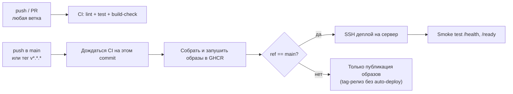

# Arvexo Radar: CI/CD

**Версия:** v0.1.0 — Hackathon MVP
**Статус:** операционная спецификация
**Связанные документы:** [Deployment](./17-deployment.md), [Security](./16-security.md), [Backend](./12-backend.md), [Frontend](./13-frontend.md)

## 1. Назначение документа

Документ описывает автоматизацию сборки, проверки и развёртывания Arvexo Radar через GitHub Actions: что запускается на каждый push/PR (CI), что публикуется в registry и разворачивается на сервере (CD), какие секреты для этого нужны и как диагностировать сбой пайплайна. Реализация — `.github/workflows/ci.yml` и `.github/workflows/cd.yml`.

## 2. Обзор пайплайна



Два независимых workflow:

- **CI** (`ci.yml`) — на каждый push в любую ветку и на каждый PR в `main`. Ничего не публикует и не требует деплойных секретов.
- **CD** (`cd.yml`) — на push в `main` и на теги `v*.*.*`. Публикует образы в GHCR; автоматический деплой на сервер выполняется только для `main`.

## 3. CI: что проверяется

| Job | Что делает | Почему так |
|---|---|---|
| `backend-lint` | `ruff check app tests` | Быстрый провал без поднятия БД |
| `backend-test` | `alembic upgrade head` + `pytest` против **реального** `pgvector/pgvector:pg16` service-контейнера | Схема использует JSONB и расширение `vector` (docs/14-database.md); sqlite/мок ничего бы не проверил про миграции |
| `frontend-build` | `npm install`, `tsc --noEmit`, `next build` | Ловит поломки типов и сборки до merge |
| `docker-build` | Собирает `backend/Dockerfile` и `frontend/Dockerfile` через `docker/build-push-action` с `push: false` | Ловит поломку Dockerfile на PR без доступа к registry-секретам |

Все job'ы независимы и идут параллельно; `ci.yml` не имеет прав `packages: write` и не использует деплойные секреты — PR из форков безопасно его запускают.

## 4. CD: сборка и публикация образов

`cd.yml` запускается на `push` в `main` и на теги `v*.*.*` (workflow_dispatch тоже доступен для ручного прогона).

1. **`wait-for-ci`** — ждёт, что CI-проверки на этом же commit SHA зелёные (`lewagon/wait-on-check-action`), прежде чем собирать что-либо. Красный `main` не должен доехать до образа.
2. **`build-and-push`** — собирает и пушит в GHCR два образа:
   - `ghcr.io/<owner>/<repo>-api` — единый образ для `api` и `worker` (различаются только `command:`, как и в dev `docker-compose.yml`);
   - `ghcr.io/<owner>/<repo>-web` — фронтенд.

   Каждый образ получает три тега (`docker/metadata-action`): `latest` (только для `main`), `sha-<short>` (всегда) и semver-тег `X.Y.Z` (только когда триггер — тег `vX.Y.Z`). Деплой всегда использует `sha-<short>` конкретного commit, а не мутирующий `latest`, чтобы не поймать гонку с параллельным пушем.
3. **`deploy`** — выполняется только если `github.ref == 'refs/heads/main'` (пуш тега публикует образы, но не трогает сервер — это осознанное решение см. раздел 8). Использует `docker/setup-buildx-action` + `type=gha` layer cache, поэтому повторные сборки быстрее холодных.

## 5. CD: деплой на сервер

Деплой — SSH-скрипт (`appleboy/ssh-action`) на сервер, где заранее лежат `docker-compose.prod.yml` и `.env` (не в Git, см. раздел 6.2):

```bash
docker login ghcr.io -u "$GHCR_USER" --password-stdin <<< "$GHCR_TOKEN"
export API_IMAGE=ghcr.io/<owner>/<repo>-api:sha-<short>
export WEB_IMAGE=ghcr.io/<owner>/<repo>-web:sha-<short>
docker compose -f docker-compose.prod.yml pull
docker compose -f docker-compose.prod.yml up -d
docker compose -f docker-compose.prod.yml exec -T api alembic upgrade head
docker image prune -f
```

После деплоя отдельный шаг читает `API_HOST_PORT` из `.env` на сервере и дёргает `curl http://127.0.0.1:${API_HOST_PORT}/api/v1/health` и `/ready` — если сервис не поднялся, workflow падает красным сразу, а не молча оставляет сервер в битом состоянии. Проверяется именно loopback-порт контейнера, а не публичный `https://radar.arvexo.ru` — так smoke test работает и на свежем сервере, где nginx/DNS/TLS ещё не настроены.

`docker-compose.prod.yml` — самостоятельный (не overlay поверх dev `docker-compose.yml`): Compose-семантика слияния списков (`ports`, `volumes`) между файлами зависит от YAML-тегов `!reset`/`!override`, которые требуют относительно новой Compose CLI — не факт, что она есть на сервере. Самостоятельный файл предсказуем без кросс-референсов. Отличия от dev-версии:

- образы вместо `build:`;
- без bind-mount исходников и `--reload`;
- `db` не публикует порт `5432` наружу (docs/16-security.md: "DB не публикуется в production profile");
- `api`/`web` публикуются только на `127.0.0.1:${API_HOST_PORT}`/`127.0.0.1:${WEB_HOST_PORT}` (по умолчанию `38000`/`38080` — 80/443/3000/8000 на сервере уже заняты nginx и другими сервисами), наружу их отдаёт nginx — см. `deploy/nginx/radar.arvexo.ru.conf`;
- `restart: unless-stopped` на всех сервисах.

### 5.1. nginx и домен `radar.arvexo.ru`

`deploy/nginx/radar.arvexo.ru.conf` — reverse proxy с `/api/` на `API_HOST_PORT` и `/` на `WEB_HOST_PORT`. Ставится один раз вручную на сервере (не через CD — конфигурация nginx вне scope деплоя приложения):

```bash
sudo cp deploy/nginx/radar.arvexo.ru.conf /etc/nginx/sites-available/radar.arvexo.ru
sudo ln -s /etc/nginx/sites-available/radar.arvexo.ru /etc/nginx/sites-enabled/
sudo nginx -t && sudo systemctl reload nginx
sudo certbot --nginx -d radar.arvexo.ru   # TLS, переписывает конфиг под HTTPS
```

Если порты в `.env` (`API_HOST_PORT`/`WEB_HOST_PORT`) отличаются от дефолтных `38000`/`38080`, поправить `set $api_port`/`set $web_port` в конфиге. После этого `NEXT_PUBLIC_API_BASE_URL=https://radar.arvexo.ru/api/v1` и `ARVEXO_CORS_ORIGINS=["https://radar.arvexo.ru"]` в `.env` (см. `.env.example`).

## 6. Требуемая конфигурация

### 6.1. GitHub Actions secrets

| Secret | Назначение |
|---|---|
| `DEPLOY_HOST` | Адрес сервера |
| `DEPLOY_USER` | SSH-пользователь |
| `DEPLOY_SSH_KEY` | Приватный SSH-ключ (PEM), публичная часть — в `~/.ssh/authorized_keys` на сервере |
| `DEPLOY_PORT` | SSH-порт (опционально, по умолчанию 22) |
| `DEPLOY_PATH` | Путь на сервере — git clone этого репозитория (не просто папка с файлами, см. 6.2) |

`GITHUB_TOKEN` для входа в GHCR передаётся автоматически Actions — отдельный секрет не нужен ни для сборки, ни для `docker login` на сервере (используется как pull-токен через SSH-сессию, никогда не хранится на сервере в файле).

### 6.2. Сервер (заполняется вручную один раз)

`DEPLOY_PATH` — полноценный git clone репозитория, а не просто скопированный `docker-compose.prod.yml`: деплой-скрипт делает `git fetch && git reset --hard origin/main` перед `docker compose ... pull/up`, чтобы файл всегда соответствовал `main` без отдельного шага копирования. `.env` не отслеживается git (`.gitignore`), поэтому `git reset --hard` его не трогает.

```bash
ssh-keygen -t ed25519 -f deploy_key -N "" -C "github-actions-arvexo-radar"
# приватный ключ -> secret DEPLOY_SSH_KEY, публичный -> authorized_keys на сервере
cat deploy_key.pub >> ~/.ssh/authorized_keys   # на сервере, под DEPLOY_USER

git clone <repo-url> /var/www/Arvexo-Radar   # или любой путь = DEPLOY_PATH
cd /var/www/Arvexo-Radar
cp .env.example .env   # затем заполнить реальными значениями
```

`DEPLOY_USER` должен состоять в группе `docker` (`usermod -aG docker <user>`), иначе `docker compose` в SSH-сессии упадёт по правам.

`.env` на сервере никогда не коммитится (docs/16-security.md SEC-09) и содержит как минимум `POSTGRES_PASSWORD`, `ARVEXO_DATABASE_URL` (host `db`, не `localhost`), `ARVEXO_ANALYTICS_USER_HASH_SALT` (длинный случайный секрет), выбранный `ARVEXO_LLM_PROVIDER_MODE` и, если не `mock`, ключи соответствующего провайдера.

## 7. Версионирование образов и rollback

- Каждый деплой детерминирован конкретным `sha-<short>` — можно откатиться, вручную выставив `API_IMAGE`/`WEB_IMAGE` на предыдущий SHA и повторно запустив `docker compose -f docker-compose.prod.yml up -d` на сервере.
- Теги `vX.Y.Z` создают semver-образы в GHCR независимо от деплоя — это фиксирует релизную точку, даже если авто-деплой в тот момент не нужен.
- `docker image prune -f` после деплоя убирает только dangling-образы (без тега), не трогая предыдущий рабочий тег, пока он используется другим контейнером или явно не удалён.

## 8. Явные решения и их причины

- **Деплой только с `main`, не с тегов.** Тег может резать релиз заранее (например, для changelog) без немедленного выката; `main` — источник истины для того, что реально работает на сервере.
- **`wait-for-ci` вместо дублирования тестов в CD.** Не гонять pytest/ruff дважды: CD доверяет CI-статусу того же commit SHA.
- **`docker-compose.prod.yml` не overlay.** См. раздел 5 — портируемость важнее сухости (DRY) конфигурации.
- **SSH, не self-hosted runner/Kubernetes.** Соответствует зафиксированному стеку (docs/09-architecture.md: Docker Compose, без оркестраторов) и Hackathon MVP scope.

## 9. Диагностика сбоев

| Симптом | Где смотреть |
|---|---|
| CI красный на `backend-test` | Логи job — миграция или тест; локально: `docker compose run --rm api alembic upgrade head && docker compose run --rm api python -m pytest -q` |
| CD зависла на `wait-for-ci` | Проверить, что CI вообще запустился на этом SHA (иногда — при push тега без предварительного push в ветку) |
| `deploy` упала на `docker login` | `DEPLOY_*` secrets или сетевой доступ сервера до `ghcr.io` |
| `deploy` упала на smoke test | `docker compose -f docker-compose.prod.yml logs api` на сервере; чаще всего — не заполнен `.env` |
| Образ есть в GHCR, но деплой не запустился | Проверить `github.ref` события — деплой не триггерится на push тега (см. раздел 8) |

## 10. Acceptance criteria

- **CICD-AC-01:** PR из форка проходит `ci.yml` без доступа к деплойным секретам.
- **CICD-AC-02:** ни один образ не публикуется из commit, где `ci.yml` не прошёл на этом же SHA.
- **CICD-AC-03:** деплой использует неизменяемый `sha-<short>` тег, не мутирующий `latest`.
- **CICD-AC-04:** секреты БД/провайдера не появляются в логах workflow.
- **CICD-AC-05:** сбой smoke-теста после деплоя виден как красный workflow, а не только в логах сервера.
- **CICD-AC-06:** `db` не публикует порт наружу в `docker-compose.prod.yml`.

## 11. Границы документа

Документ не определяет: политику ротации `DEPLOY_SSH_KEY`, backup/retention для `db_data` на проде, blue-green или canary деплой (не входит в Hackathon MVP scope), мониторинг/алертинг сверх smoke-теста. Эти решения — предмет отдельной спецификации после MVP.

## 12. Связанные документы

- [Deployment](./17-deployment.md)
- [Security](./16-security.md)
- [Backend](./12-backend.md)
- [Frontend](./13-frontend.md)
- [Architecture Decisions](./21-architecture-decisions.md)
